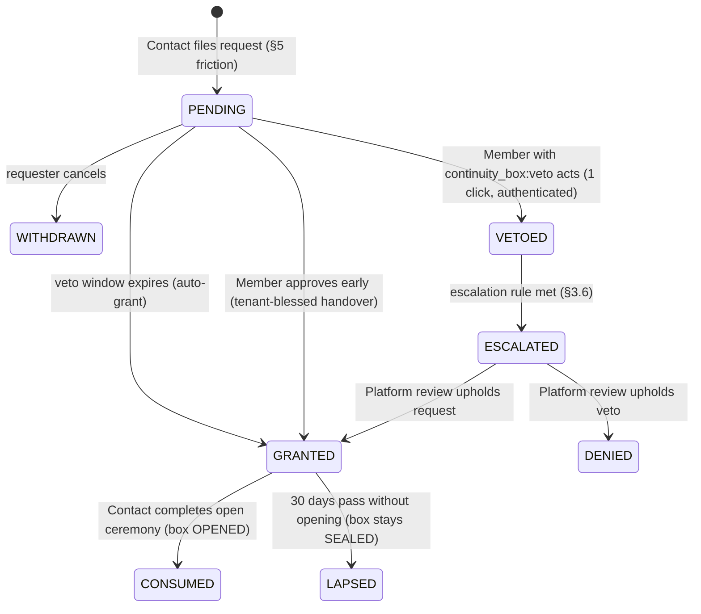

# CONTINUITY_BOX.md — Sealed Continuity Box, Both Levels

**Fortleva · Phase 0 specification · 2026-08-03**
Covers brief §8 in full (tenant→client box **and** platform→tenant continuity), plus its touchpoints with §3 (permissions), §4 (entitlements), §5 (isolation/visibility), §7 (lifecycle), §9 (audit, encryption, GDPR) and §11 (phasing).
Sibling docs referenced: `DATA_MODEL.md` (ContinuityBox / ContinuityOpenRequest schema), `SECURITY.md` (field-encryption service, threat model), `AUTHZ.md` (permission codes, portal capability set), `PLAN.md` (Phase 8), `OPEN_QUESTIONS.md` (items flagged here).

This is the product's hardest and most differentiating feature. No competitor surveyed (SuiteDash, Assembly/Copilot, Moxie, Bonsai, Plutio, Accelo) has anything like it. It is also the feature where a sloppy design creates legal exposure rather than mere bugs — hence the length of this document.

---

## 1. Requirements restated, and the two settled decisions

### 1.1 Requirements (brief §8)

| # | Requirement | Where answered |
|---|---|---|
| R1 | One sealed box per Client, authored/updated by Members holding a specific permission | §2, §6, §7 |
| R2 | Contents encrypted such that a database dump alone reveals nothing | §2.2–2.6, §2.8 |
| R3 | The Client can open it exactly once; irreversible, permanently logged | §1.3, §4 |
| R4 | Openable only under defined trigger conditions, not on a whim | §3, §5 |
| R5 | Opening notifies the Tenant immediately on every available channel + nominated fallback | §3.3, §4.1 |
| R6 | Contents downloadable as one package after opening (hosting/domains may be lapsing) | §4.3–4.4 |
| R7 | Platform-level continuity: exports tenants hold themselves, self-hosting/escrow, dead-man posture for the Platform itself | §10 |
| Q1 | Trigger model evaluation (heartbeat / trustee / manual / combination), incl. holiday + app-down failure modes | §3.1, §3.7 |
| Q2 | Key custody so the running app cannot decrypt, but recovery works in the trigger scenario; Platform must be *unable* to read | §2.4, §2.8 |
| Q3 | "Exactly once" that survives a failed mid-transfer download | §1.3, §4 |
| Q4 | Abuse/accident friction | §5 |
| Q5 | Contents template; pointers vs live credentials | §6 |
| Q6 | Legal question list for a Swedish lawyer + ToS disclaimers | §9 |

### 1.2 FINAL decision #1 — key custody is 2-of-3 Shamir

> **Decided (founder, 2026-08-03, non-negotiable):** the box key is split with a 2-of-3 Shamir secret sharing scheme. **Share A** — a printed "continuity card" generated client-side and held by the Client. **Share B** — stored in the Platform database (a single share is information-theoretically useless alone). **Share C** — held by a trustee. The Platform alone can never decrypt; loss of the card is recoverable via the other two shares.

What this means precisely:

- The Platform's total holdings — ciphertext in R2 plus Share B in Postgres — are cryptographically insufficient to read any box. This is a mathematical property of Shamir over GF(2⁸) ([privy-io/shamir-secret-sharing](https://github.com/privy-io/shamir-secret-sharing), independently audited twice), not a policy promise. A full dump of database **and** object storage yields nothing (R2, brief requirement, and §2.8).
- Any two shares plus the ciphertext decrypt. The two client-side shares (A + C) can decrypt **without the Platform** — essential for the platform-gone failure mode (§8, §10). Share B exists so that losing one client-side share is survivable: the Platform releases B only at the moment of a procedurally granted open (§4).
- The Platform must therefore **never** hold Share C in any form (invariant INV-2 below), or the guarantee collapses to "trust us".
- Rejected custody options the brief asked us to evaluate: KMS-gated key (the operator owns the cloud account and can rewrite the key policy — procedural, not cryptographic exclusion; acceptable later only as an extra wrap on Share B), time-lock encryption via drand/tlock (decrypts at a *date*, not an *event* — wrong semantics, plus a hard dependency on an external consortium, [drand docs](https://docs.drand.love/docs/timelock-encryption/)), Bitwarden-style wrapping to the Contact's password-derived keypair (our invite-only portal has admin-initiated resets that would silently break the guarantee), HSMs/enclaves (over-engineering at tens of tenants). A single scrypt passphrase card (platform stores zero key material) was the runner-up; rejected because card loss = box loss with no recovery margin.

### 1.3 FINAL decision #2 — open-once + 7-day download window

> **Decided (founder, 2026-08-03, non-negotiable):** "exactly once" means an irreversible, logged **OPEN** state transition, followed by a **7-day download window** with unlimited re-downloads of the same single blob, every access logged. Marketing wording: *"opened exactly once, downloadable for 7 days, fully logged."*

What this means precisely:

- **Open-once** is a property of the *state machine*, not of the byte transfer. The SEALED→OPENED transition happens exactly once, atomically, and can never be reversed or repeated (§4.2).
- **The window** exists because burn-on-first-read demonstrably fails: a dropped connection at 80% would lock the Client out of their own data forever — the exact catastrophe the brief warns about (§8 Q3). Mature precedents all separate "triggered" from "downloaded": Google Inactive Account Manager gives trusted contacts [3 months to download](https://hacked.com/google-inactive-account-manager); Apple Legacy Contact grants a [3-year access window](https://support.apple.com/guide/security/legacy-contact-security-secebf027fb8/web). Seven days is deliberately much shorter than both — the box is an emergency handover, not an archive — and aligns with R2's hard maximum presigned-URL lifetime of [7 days](https://developers.cloudflare.com/r2/api/s3/presigned-urls/), so even a maximally-lived signed URL cannot outlive the window.
- **Same blob only.** Nothing new becomes accessible during the window; re-downloads re-fetch the identical ciphertext. Each presigned-URL issuance is an `AuditEvent` (§4.3).
- After the window the box is **CLOSED**: permanently inaccessible via the product, blob deleted on the retention schedule (§4.3), metadata and the full audit trail retained.

### 1.4 Invariants

These are the testable core of the feature. CI must assert every one that is mechanically checkable.

| ID | Invariant |
|---|---|
| INV-1 | Box plaintext never leaves the sealing Member's browser. The server never receives, logs, or stores plaintext or any key material other than Share B. |
| INV-2 | The Platform stores at most one share (B), encrypted at rest. Shares A and C are never transmitted to, or generated on, the server. |
| INV-3 | No key material is ever sent by email or written to logs. (Email transits the ESP; a share in an email breaks operator-cannot-read.) |
| INV-4 | Ciphertext is only ever released via presigned URL when box status = OPENED and now < window end. |
| INV-5 | SEALED→OPENED occurs at most once per box, in one transaction with its `AuditEvent`. |
| INV-6 | No automatic open exists anywhere. Every open is a human Contact's explicit ceremony after a granted request. Dead-man signals may shorten windows; they never open boxes. |
| INV-7 | Every lifecycle event (seal, reseal, re-key, request, veto, grant, dispute, open, URL issuance, close, deletion) is an append-only `AuditEvent`, visible to the Tenant and the Platform (§9 of the brief; event catalog in `SECURITY.md`). |
| INV-8 | Entitlement or billing lapse never blocks the request/open/download path (§11). |
| INV-9 | A box's veto-window configuration is frozen the moment a request is filed (LastPass precedent: the [waiting period locks when a request is made](https://www.lastpass.com/features/emergency-access)). |
| INV-10 | The runtime storage credential cannot delete continuity blobs; deletion runs only via a separate scheduled job with separate credentials (§2.6). |

---

## 2. Sealing flow and trust model

### 2.1 Roles in the flow

- **Sealing Member**: a Member holding `continuity_box:edit` (authoring, sealing, resealing, re-keying) *and* assignment to the Client (deny-default scoping, settled decision #5). Trigger configuration — veto window, trustee, fallback contact — is the separate `continuity_box:configure` code. Both are seeded on the owner template only and both are ✦ `requiresMfa` (`AUTHZ.md` §3.2, which owns the catalog; there is no `continuity_box:manage`).
- **Cardholder Contact**: the Contact at the Client who receives Share A. Recorded on the box as `beneficiaryContactId` (`DATA_MODEL.md` is the naming authority; the column is the *cardholder of record*, not the gate on who may request an open — §3.2).
- **Trustee**: holder of Share C — a person, not a principal, in v1 (§2.4). Recorded as descriptor fields (name, relationship, contact info).
- **Platform**: custodian of ciphertext + Share B; procedural gatekeeper; cryptographically excluded from contents.

### 2.2 Package assembly — entirely in the browser

The seal is a **single-session ceremony** in the sealing Member's browser:

1. The Member fills the structured contents template (§6) and attaches supporting files (architecture PDFs, diagrams). Cap: 256 MB per box in v1 (single-part R2 PUT; streaming/multipart is v2).
2. The browser builds one ZIP: `manifest.json` (template version, box id, seal timestamp, file list with SHA-256 hashes) + rendered handover document + attachments.
3. **No server-side drafts.** Plaintext never touches the server (INV-1), which rules out multi-session draft storage. The ceremony UI says so and encourages preparing source material beforehand. This is deliberate, not a limitation to fix: the box is a *snapshot* of operational knowledge whose masters live in the Tenant's own systems — the Tenant re-assembles from those masters at every reseal (§7). After sealing, the box is write-only even for the Tenant: the Member retains no share and cannot re-read what they sealed. An encrypted server-side working copy is a possible v2 convenience; skip for v1.

### 2.3 Encryption

- The browser generates a fresh **age X25519 identity** using WebCrypto CSPRNG and encrypts the ZIP to its recipient with [`age-encryption`](https://github.com/FiloSottile/typage) (typage — the official TypeScript implementation of [age](https://github.com/FiloSottile/age), built on noble/WebCrypto, Node 18+/browsers). Output: one `.age` blob.
- Why age and not hand-rolled AES-GCM or libsodium sealed boxes: age is a stable, single-file, widely implemented *format* — meaning the blob is decryptable in 10 years with the standard `age` CLI and no Fortleva code, which is precisely the property a continuity artifact needs. The recovery story (§4.4) depends on it.
- The 32-byte identity scalar is split 2-of-3 with [`privy-io/shamir-secret-sharing`](https://github.com/privy-io/shamir-secret-sharing) (zero-dependency TypeScript, GF(2⁸), audited twice). Shares are 33 bytes.
- The browser computes SHA-256 of the ciphertext, uploads the blob via a presigned PUT (Content-Length signed, HEAD-verified — the R2 no-presigned-POST pattern from `ARCHITECTURE.md`), and posts metadata + Share B. Shares A and C are rendered as cards (§2.5) and **discarded from memory**; the identity scalar is discarded; done.

### 2.4 Share custody

| Share | Holder | Form | At rest |
|---|---|---|---|
| **A** | Cardholder Contact (Client side) | Printed continuity card, generated client-side, never touches the server | Physical, Client's custody |
| **B** | Platform | DB column on `ContinuityBox` | Wrapped with the platform field-encryption service (AES-256-GCM, `SECURITY.md`) — defense in depth on top of "one share is useless" |
| **C** | Trustee | Second printed card, same ceremony | Physical, trustee's custody |

**Trustee onboarding options (v1 = a person holding a card; no trustee login):**

| Option | Description | Verdict |
|---|---|---|
| Second Contact at the Client | Another person at the Client company gets card C | **Default (v1).** Zero onboarding, reachable in exactly the scenarios that trigger the box, covers the dead-cardholder case. Cost: correlated physical loss (same office) — the UI recommends separate storage locations. |
| External professional of the Client | The Client's lawyer or accountant; card handed/couriered by the Client | **Recommended upgrade, offered in UI (v1).** Best failure isolation; survives Client office loss and Client-side disputes. |
| Tenant-side trustee (the agency's own lawyer) | Card held on the Tenant's side | **Allowed, warned against.** In the trigger scenarios (death, konkurs) the Tenant side is unavailable or legally conflicted — a konkursförvaltare could control the trustee relationship (§9). |
| Platform as trustee | Platform stores C | **Forbidden (INV-2).** B + C = 2 shares = the Platform can decrypt. Never, including "temporarily". |
| Trustee as a first-class principal with portal login | Trustee identity, online share custody | **v2.** Requires trustee identity/session design and shifts C from physical to online custody — a real trade-off to design properly, not a quick add. |

**Never email key material (INV-3).** Cards are generated in-browser (client-side PDF), printed or saved locally by the sealing Member, and handed over physically or via the Tenant's own secure channel. The UI states this rule and why: email transits the ESP (Resend/Postmark logs); a share in an email quietly converts "the Platform cannot read" into "the Platform's email provider can". URL-fragment delivery (key after `#`, [never sent to the server](https://privatenote.ai/blog/one-time-secret-links)) was considered and rejected for shares: links get pasted into email and persist in browser history — cards beat links.

**Receipt acknowledgment.** After sealing, the Cardholder Contact gets a portal task: *"Confirm you have received and stored the continuity card."* Confirmation (with storage-advice text) is an `AuditEvent`; an unacknowledged card after 30 days nags the Tenant. Same for a trustee acknowledgment, recorded by the Tenant on the trustee's behalf.

### 2.5 Continuity card — contents spec

Both cards share a layout, A5, print-optimized, bilingual (Swedish + English, per brief §12; more locales later — no hardcoded strings). Contents:

1. **Header**: "Continuity card — Share A (Client)" / "Share C (Trustee)"; Tenant name; Client name; box ID; key generation number and date.
2. **The share**: QR code + human-transcribable text — 33 bytes, Base32, 4-character groups (~56 chars) with a CRC checksum so typos are caught at entry.
3. **Key fingerprint**: the age recipient public key (`age1…`). This identifies the *key generation*, so a card can be matched to the box even across content reseals (§2.7). Deliberately **not** the blob hash — blobs change at every reseal; the key generation does not.
4. **Scheme statement**: "This is 1 of 3 shares; any 2 shares plus the sealed file decrypt it. This card alone reveals nothing. Share format: privy-io/shamir-secret-sharing v0.x (GF(256), 33-byte shares). File format: age v1."
5. **Instructions — normal path**: portal URL, "request opening" flow summary, what to expect (notification to the provider, waiting period, 7-day download window).
6. **Instructions — offline path** (platform-gone): where the sealed file may be found (the provider's data export bundle; the Client's own copy if one was shared), the static recovery tool URL (§4.4), and the note that any standard age implementation works once shares are recombined.
7. **Care instructions**: store like a passport; never photograph/email; report loss to the provider (forces re-key); "supersedes card generation N−1" when re-keyed.
8. Issue date and the sealing Member's name.

### 2.6 Storage: R2 EU-jurisdiction bucket, DB metadata only

- **Dedicated bucket**, separate from the general Document/FileObject bucket: created with [`jurisdiction=eu`](https://developers.cloudflare.com/r2/reference/data-location/) (immutable at creation; EU-pinned storage, `<account>.eu.r2.cloudflarestorage.com` endpoint), with a [bucket lock](https://developers.cloudflare.com/r2/buckets/bucket-locks/) retention rule of **90 days from write** on continuity objects. The lock makes freshly sealed blobs undeletable even with compromised credentials during the window where tampering is most attractive.
- Honest limits of the lock: it cannot protect a 2-year-old sealed blob without also blocking reseal cleanup and GDPR erasure forever. The durable protections are therefore: (a) **the runtime storage credential has no delete permission on this bucket** (INV-10) — deletions run only in a scheduled cleanup job with its own credential, after lock expiry; (b) sealed blobs are included in the Tenant's own export bundles (§10.1), so a Tenant-held copy exists off-platform; (c) SHA-256 verification on every download detects substitution.
- **DB holds metadata only** (`ContinuityBox` — full schema in `DATA_MODEL.md`): status, `clientId` (unique — one box per Client, R1), blob key, ciphertext SHA-256, size, `recipientPublicKey`, `keyGeneration`, `sealVersion`, `sealedAt`, `sealedByMemberId`, template version, attachment *count* (deliberately **no** internal file list — the manifest lives only inside the ciphertext, so DB metadata leaks nothing about contents), wrapped Share B, cardholder/trustee descriptors, veto-window config, fallback-notification target, request history (via `ContinuityOpenRequest`).
- The blob is deliberately **not** a `FileObject`/`Document`: no visibility flag, no previews, no attachment semantics, different bucket, different lifecycle, different credentials. Modeling it through the general file layer would invite exactly the accidental-exposure bug class §5 of the brief fears most.

### 2.7 Reseal vs re-key

Two distinct operations, because ritual friction is the enemy of freshness (§7):

- **Content reseal** (routine, quarterly): new ZIP → encrypted to the **same** age recipient → new blob replaces old; `sealVersion`++. **Cards stay valid** — no redistribution, near-zero friction. The old blob is marked superseded and deleted by the cleanup job after lock expiry.
- **Re-key** (exceptional): new identity, new 2-of-3 split, new cards for cardholder and trustee, `keyGeneration`++. Forced when: the cardholder Contact is offboarded (§7), a card is reported lost/compromised, or the trustee changes. Old cards are announced superseded (they cannot decrypt the new blob).

**Pushback / deviation note (against the research detail, not against any settled decision):** the research synthesis sketched "each reseal is a new blob + new card". We deviate: a new card every quarter means physically re-distributing two cards per client per quarter, which guarantees the ritual dies and boxes rot — the exact #1 product risk. Keeping the recipient stable across content reseals costs nothing cryptographically that matters here: a leaked card is equally harmless in both designs (one share reveals nothing without a second share *and* the ciphertext, which the Platform releases only through the procedure), and card-holder changes still force a full re-key. Trade-off accepted: one key generation protects all content generations until a re-key event.

### 2.8 Who can read what — threat table

| Adversary / situation | Holds | Can read box contents? |
|---|---|---|
| Platform operator (normal operation) | Ciphertext + wrapped B | **No** — one share is information-theoretically useless |
| Full DB dump | Wrapped B, metadata | **No** (R2 ciphertext not even present) |
| DB dump + R2 dump (total platform breach) | Ciphertext + B (if field key also stolen) | **No** — still one share |
| Total platform breach **+ stolen physical card** | Ciphertext + B + A or C | **Yes** — accepted residual risk; requires combining a digital breach with physical theft targeting one client |
| Card thief (A or C alone) | One share, no ciphertext | **No** |
| Rogue trustee | C, no ciphertext | **No** |
| Client holding A + C (impatient) | Two shares, **no ciphertext** | **No** until the procedure releases the blob — ciphertext custody is the procedural gate (§3) |
| Platform + trustee collusion | B + C + ciphertext | **Yes** — mitigated by trustee being chosen by/for the Client (§2.4); forbidden-by-design for Platform-held C |
| Subpoena / CLOUD Act against Platform or Cloudflare | Ciphertext + B | **No plaintext to give.** Client-side encryption is exactly what neutralizes the US-provider debate around R2 ([R2 data location](https://developers.cloudflare.com/r2/reference/data-location/)) |

**Known limitation (stated for honesty, as `SECURITY.md` also notes):** browser-delivered cryptography means a *malicious future version of the app* could serve poisoned ceremony code that exfiltrates keys at seal time. The guarantee is "the Platform cannot read what was sealed", not "the Platform could never have backdoored a ceremony". Mitigations: the ceremony and recovery code are published open-source (§4.4), changes are auditable, and the sealing Member's browser is the only place plaintext ever exists. This is the standard, accepted posture of web-based E2EE products; anything stronger requires signed native clients — out of scope (skip).

---

## 3. Trigger model and state machine

### 3.1 Evaluated trigger models (brief Q1)

| Model | How it works | Failure modes | Verdict |
|---|---|---|---|
| Pure dead-man heartbeat | Tenant checks in every N days; missed check-ins + grace arm/open the box | Holiday, hospital, ignored inbox → false arming; the documented failure mode of [deadmansswitch.net](https://www.deadmansswitch.net/help/)-class services. Also arms boxes for *all* clients at once | **Rejected as primary.** Inactivity is evidence, not intent |
| Nominated trustee approval | A named human approves each open | Single point of failure (trustee dies/moves); adds adjudication burden on a person | **Folded in** as Share C custody, not as an approval gate |
| Manual arming | Tenant arms the box when they know risk is imminent | People do not schedule their own disappearance | **Rejected** as the primary; tenant-approved instant grant is kept (§3.2) |
| Platform adjudication (Apple-style document review as the required path) | Requester submits death certificate etc.; Platform reviews | Puts the Platform in the verification business with real liability; Apple can afford [manual review + certificates](https://support.apple.com/guide/security/legacy-contact-security-secebf027fb8/web); we reserve it for disputes only | **Rejected as default path; kept for disputes** |
| **Request + veto window + auto-grant** (Bitwarden Emergency Access model) | Beneficiary requests; owner is notified and can veto during a configurable wait; auto-grant on expiry ([Bitwarden](https://bitwarden.com/help/emergency-access/), [LastPass](https://www.lastpass.com/features/emergency-access)) | False *requests* create noise (mitigated §5); hostile veto (mitigated §3.6) | **Chosen.** Human intent initiates; time + silence corroborate; the Tenant always gets the chance to say "I'm alive" |

The chosen model is a *combination*, as the brief invited: an affirmative human request (manual), a veto window (trustee-like control, held by the Tenant), and passive dead-man signals as corroboration only (heartbeat demoted to evidence).

### 3.2 States and transitions

**ContinuityBox** (`ContinuityBoxStatus`, `DATA_MODEL.md` §6.12): `SEALED → OPEN_REQUESTED → OPENED → CLOSED`, plus the `rekeyRequired` flag, which is a flag and not a state (§7). `OPEN_REQUESTED` means "a PENDING request exists" — a display and query convenience only: the box is still sealed, nothing cryptographic has changed, and a veto or withdrawal returns it to `SEALED`. The exactly-once transition of INV-5 is therefore `(SEALED | OPEN_REQUESTED) → OPENED`.

**ContinuityOpenRequest** (one active at a time per box) — the eight states of `ContinuityOpenRequestState`, spelled exactly as `DATA_MODEL.md` defines them (`PENDING` is this doc's former "REQUESTED"; `ESCALATED` is its former "DISPUTED"):

| Transition | Trigger | Rules |
|---|---|---|
| → PENDING | Any **active Contact of the Client on the `CONTACT_PRIMARY` profile**, holding the portal capability `portal.continuity.request_open` (`AUTHZ.md` §8). Not restricted to the cardholder — the dead-cardholder path (§8) depends on that. `CONTACT_COLLABORATOR` contacts have no continuity capabilities at all; per-Contact toggles within a profile are **v2** | Requires reason category (*provider unreachable / known death or incapacity / known insolvency / other*) + free-text, which becomes the evidentiary record. Blocked during cooldown. Window length is snapshotted onto the request (INV-9) |
| PENDING → VETOED | One click by any Member holding `continuity_box:veto` (seeded on CEO/Manager/Admin templates) via authenticated session | Starts a **30-day cooldown** for new requests on this box. Veto reason optional but encouraged. Signed-link veto without login: v2 (safe direction — a forged veto only preserves the status quo — but auditable actor identity wins for v1) |
| PENDING → GRANTED (auto) | Window expiry, evaluated lazily on access **and** by a scheduled job (Vercel cron — pg_cron does not fire on scale-to-zero Neon, per `ARCHITECTURE.md`) | Timers are computed from stored timestamps, never from cron ticks, so missed cron runs delay nothing |
| PENDING → GRANTED (early) | Explicit approval by a Member with `continuity_box:veto` | The graceful-handover path: planned retirement, agreed transition |
| GRANTED → CONSUMED | Open ceremony (§4.1) | The only path to box OPENED |
| GRANTED → LAPSED | 30 days without opening | Box remains SEALED; a new request restarts the full procedure |

**Veto window**: per-box configurable at seal time, **7–60 days; default 21** — picked as the balance between holiday absorption and a defunct-agency wait, and auto-shortened to the 7-day floor when dead-man signals corroborate (§3.5). This is the single value all four docs carry: `DATA_MODEL.md` (`vetoWindowDays Int @default(21)`), `OPEN_QUESTIONS.md` C3(a), `PLAN.md` Phase 8. Frozen once a request exists (INV-9).

### 3.3 Notifications: multi-channel, escalating, to everyone relevant

On PENDING, and repeatedly until resolution:

- **Who**: every Member holding `continuity_box:veto`; every owner-equivalent Member; the box's **nominated fallback contact** — an out-of-band name/email/phone the Tenant records at first seal (tenant-level default in `TenantPreference`, overridable per box). The fallback is a notification target, not a principal — no login, no veto power; their job is to physically reach the Tenant ("your client is trying to open the continuity box — log in").
- **Channels (v1)**: email + persistent in-app banner on every tenant-plane page. **SMS to the fallback phone: v2.** *Pushback:* for a feature whose entire premise is reaching an unresponsive Tenant, email-only is the design's weakest link; Twilio SMS to the fallback number is cheap and should be the first post-v1 addition, ahead of nicer things.
- **Cadence** (escalating, per the dead-man-service pattern of [multiple warnings before action](https://www.deadmansswitch.net/help/)): immediately; day 3; day 7; every 3 days thereafter; daily over the final 5 days. Every message: who requested, stated reason, exact auto-grant date, one-click veto path.
- Every notification dispatch is itself an `AuditEvent` — in a later dispute, "the Tenant was notified 11 times over 21 days on 3 addresses" is the Platform's procedural defense (§9.4).

### 3.4 Veto and cooldown

A veto is deliberately effortless (one authenticated click) because the cost asymmetry favors false vetoes over false opens: a wrong veto delays a legitimate open by the cooldown; a wrong open irreversibly discloses everything. Cooldown: **30 days** per box (settled default), during which the request button is disabled with an explanation and the veto is visible to the requester with its reason. Repeated cycles feed the dispute rule (§3.6).

### 3.5 Platform-observed dead-man signals

Signals: **subscription lapsed** (Stripe status beyond the dunning grace) **AND no Member login for 60+ days** (both already captured: billing state in Phase 7, login events in the Phase 1 audit log).

Effects — strictly bounded:

1. The portal box tile gains a badge: *"This workspace's subscription has lapsed and no staff member has signed in for 60+ days. If your provider is unreachable, you may request opening."* — surfacing the request button prominently.
2. If signals are active **at request time**, the veto window shortens to the **7-day floor**; the shortening is logged and stated in every notification to the Tenant.
3. Signals feed the dispute record as evidence (§3.6).
4. **Never auto-open, never auto-request (INV-6).** Inactivity is evidence of absence, not of the Client's need.

Disclosure honesty: the badge reveals Tenant business state (billing lapse, staff inactivity) to Contacts. That is the feature working as designed, and the Tenant must knowingly sign up for it — stated in the feature's terms and in the seal-ceremony summary ("your clients will see an inactivity notice if your subscription lapses and no one signs in for 60 days"). It appears in the ToS list (§9.4).

### 3.6 Hostile veto → platform-mediated dispute

The veto protects live Tenants from impatient Clients; it must not let a defunct-but-vetoing Tenant (or whoever holds a surviving admin session — including, in konkurs, parties with contested authority) block forever. Escalation rule — a request escalates to **ESCALATED** (the dispute state) when either:

- a veto is cast **while dead-man signals are active**, or
- **2 consecutive vetoes** of requests from the same Client without any other Tenant activity between them.

Dispute = **Apple-style human review at low volume** ([manual review scales fine when rare](https://support.apple.com/guide/security/legacy-contact-security-secebf027fb8/web)): the Platform (founder, at this scale) reviews submissions from both sides — dead-man signal history, correspondence, and documentary evidence (dödsfallsintyg, Bolagsverket konkurs registration, court documents). Outcomes: **GRANTED** (Platform overrides the veto) or **DENIED** (veto upheld; extended cooldown). Every dispute action is an `AuditEvent` visible to both sides.

(States: the request moves `VETOED → ESCALATED`, and the review resolves it `ESCALATED → GRANTED` or `ESCALATED → DENIED`.)

Two properties keep this survivable for the Platform:

- **Overriding a veto is procedural power, not decryption power.** A wrongly granted request releases ciphertext + Share B — useless unless the requester also holds a client-side share (A or C). The blast radius of a bad Platform decision is bounded by the crypto (§2.8).
- The ToS frames the dispute step as *contractual procedure* (checking the described evidence), explicitly **not** adjudication of legal entitlement (§9.4). Whether it should instead be framed as expert determination is lawyer question L9 (§9.2).

Support cost is real: escrow incumbents bill release processing at [$199/hour (Codekeeper)](https://codekeeper.co/pricing). Every open request — and doubly every dispute — is a human-attention event; §11 prices this into the plan gating.

### 3.7 The two mandated failure analyses

**The holiday problem.** Tenant on a 3-week trek; impatient Client requests. Defenses, layered: (1) 21-day default window; (2) 11 escalating notifications across all admin emails; (3) the nominated fallback contact — chosen precisely as "person who can physically find me"; (4) veto is one click from a phone; (5) if it still auto-grants, the open itself notifies instantly (§4.1), and — because contents are **pointers, not credentials** (§6) — the disclosure is survivable: the Tenant rotates nothing or little, apologizes, reseals. The contents policy is trigger-policy defense-in-depth: pointer-first contents are what make a false-positive open an embarrassment instead of a breach. (6) v2: **vacation hold** — Tenant pre-announces absence and extends their windows until a date; deliberately v2 because it interacts with hostile-veto logic (a defunct agency could "be on vacation" forever — the hold must cap at, say, 90 days and suspend during active dead-man signals).

**The app-down problem.** Two cases. *Transient outage:* request/veto state is DB rows; expiry is computed from timestamps, so nothing fires wrongly during downtime — but a Tenant also cannot veto while down. Rule: if platform downtime during an open veto window exceeds 24 contiguous hours, the window extends by the downtime (logged); at multi-week window lengths this is belt-and-braces, not load-bearing. *Platform permanently gone:* the in-app procedure dies with the Platform — by design the box does **not** depend on it: the Client's A + trustee's C decrypt without any Platform involvement, given the ciphertext. Ciphertext reaches the Client via the Tenant's export bundles (§10.1, which include sealed blobs) or the wind-down procedure (§10.4, which offers Contacts their blob directly). The printed card documents this offline path (§2.5 item 6) and the static recovery tool (§4.4) works with no backend. A continuity feature whose failure mode is "the continuity vendor vanished" would be the product refuting itself — this is the design's answer to the brief's credibility point (§8, level 2).

---

## 4. Open and download

### 4.1 Preconditions and the open ceremony

Preconditions: request GRANTED (and not LAPSED); actor is an active Contact of that Client on the `CONTACT_PRIMARY` profile, holding `portal.continuity.download` (`AUTHZ.md` §8); box SEALED or OPEN_REQUESTED.

Ceremony: a full-page, plain-language confirmation (§5 for exact copy): what opening means, that it is irreversible and permanently logged, that the provider and fallback are notified immediately, that a 7-day window follows. Type-to-confirm (the word **OPEN** or the Client's name). On confirm:

### 4.2 Atomic SEALED→OPENED (INV-5)

One database transaction:

1. A single conditional update — semantically `UPDATE ContinuityBox SET status='OPENED', openedAt=now(), openedByContactId=… WHERE id=… AND status IN ('SEALED','OPEN_REQUESTED')` — whose affected-row count **must equal 1**; zero rows means a concurrent open won the race and this attempt aborts with no side effects. (Spec semantics; implementation per `DATA_MODEL.md`/`TENANCY.md`.)
2. The request row moves GRANTED→CONSUMED.
3. The `continuity_box.opened` `AuditEvent` is inserted **in the same transaction** — the open and its evidence commit or roll back together.

After commit: Share B is unwrapped and returned **once per download session** to the authenticated Contact's browser over TLS (each release logged); notifications fire to all veto-holders + fallback (*"The continuity box for {Client} was opened by {Contact} at {time}"*); the first presigned GET is issued.

### 4.3 The 7-day download window

- Window = `openedAt + 7 days`, enforced in the app on every issuance. Individual presigned URLs stay short-lived (~15 minutes each; issue-time authorization per brief §9); the 7-day figure is the *window*, aligned with R2's [presign maximum](https://developers.cloudflare.com/r2/api/s3/presigned-urls/) so no legally-issuable URL can outlive it.
- **Unlimited re-downloads of the same blob** during the window; every issuance is an `AuditEvent` (`continuity_box.download_url_issued`: contact, IP, requestId). Mid-transfer failure is a non-event: fetch again (decision #2's whole point).
- UI + email reminders at day 5 and day 6: *"store the package somewhere safe; access closes on {date}"*.
- At window end: status → CLOSED (lazily + cron). Presigns refused, Share B never served again. Blob deleted by the cleanup job **90 days after CLOSED** (bucket-lock horizon has passed; gives a forensic buffer); metadata + audit trail retained per `SECURITY.md` retention.

### 4.4 Browser-side recombination and decryption

In the Contact's browser, after download: verify ciphertext SHA-256 against DB metadata (shown in the UI); enter the card share — QR scan preferred, typed Base32 with checksum validation as the mandatory fallback; recombine card share + Share B → age identity; decrypt → the single ZIP package (R6: one file, self-contained, because hosting and domains may be lapsing exactly then).

**Static recovery tool** (v1, small but strategically important): a single self-contained open-source HTML page — file input for the `.age` blob, two share inputs, output the ZIP — embedding typage + the SSS implementation, working fully offline. Published at a stable URL on a separate static host **and included inside every tenant export bundle**, making exports self-decrypting (given two shares) with zero Fortleva infrastructure. This, plus age being a standard format, is what makes the §3.7 platform-gone answer true rather than aspirational.

### 4.5 Failure inside the window

- Card unreadable at decrypt time → the other card (trustee's C or client's A) + Share B; any 2 of 3.
- Both client-side cards unavailable → contents unrecoverable **by design**; if the Tenant is alive (false-positive open) they re-key and reseal; if not, the box is lost — stated plainly at seal time and in ToS (§9.4). No support-ticket recovery exists; that absence *is* the security model.
- Window missed entirely despite reminders → CLOSED; if the Tenant is alive, reseal; the audit trail shows the Client had 7 days and 2 reminders.

---

## 5. Abuse and accident friction

The realistic abuse case is not theft — it is **curiosity and impatience** (brief Q4). The design makes an unjustified open socially expensive, slow, and fully visible, without ever blocking a justified one.

**What the requesting Contact sees (request time):**

> *"You are requesting to open {Tenant}'s continuity box for {Client}. This is an emergency mechanism — request it only if {Tenant} has become unreachable or unable to operate.*
> *{Tenant} will be notified immediately on every channel, and can decline this request until {date}. If they decline, you cannot request again for 30 days. Every step is permanently logged and visible to both you and {Tenant}. If you reach them, withdraw this request."*
> Reason category (required) + free-text; type-to-confirm.

While pending, the Contact sees: countdown to auto-grant, the veto notice, a withdraw button. If vetoed: the veto, its reason, the cooldown end date. (Swedish + English throughout; no hardcoded strings, §12.)

**What the Tenant sees:** immediate + escalating notifications (§3.3); a tenant-plane banner with requester identity, stated reason, days remaining, and one-click **Decline** / **Approve now**; the complete request history in the box's audit view. On open: the instant notification and the full download-issuance log thereafter — nothing about the box's lifecycle is ever invisible to the Tenant.

**Friction inventory:** reason-giving (accountability) → type-to-confirm (deliberateness) → instant notification (social cost; the relationship consequence is stated in the warning itself) → veto window (no instant gratification — impatience decays over 21 days) → cooldown (no request-spam) → total mutual visibility (INV-7) → and the open ceremony repeats the irreversibility warning with a second type-to-confirm. Deliberately **absent**: any fee to request (would deter legitimate emergency use), CAPTCHA-style gimmicks, and any friction on the *download* after a legitimate open.

---

## 6. Contents template — pointers first

Settled direction (founder lean, confirmed by research): the box carries **pointers, recovery procedures, and knowledge — not live secrets**. The seal ceremony presents this as a structured checklist (template versioned; stored only inside the ciphertext):

| # | Section | Contents (pointers + instructions) |
|---|---|---|
| 1 | Domain & DNS | Registrar, account identifier (owner email, **not** password), DNS host, nameserver layout, the registrar's account-recovery/transfer procedure, renewal dates |
| 2 | Hosting & deployment | Providers, account owners, project names, how a deploy happens, CI location, what breaks if bills lapse and in what order |
| 3 | Source code | Repo host, org/repo names, who has access today, the host's ownership-succession procedure (e.g. GitHub org ownership transfer) |
| 4 | Third-party services | Every service the product depends on: ESP, analytics, payments, CDN, monitoring — service, account identifier, billing owner, criticality |
| 5 | Secrets & environment | **Where** env vars live (e.g. Vercel project settings), **where** the password vault lives, and the vault's own emergency-access arrangement (e.g. Bitwarden Emergency Access grantee + wait time) — the vault, not the box, is the credential-succession mechanism |
| 6 | Architecture notes | Stack summary, diagram (attachment), data stores, scheduled jobs, external dependencies |
| 7 | Known issues & quirks | The tribal knowledge a successor needs on day 1 |
| 8 | Handover instructions | The first 48 hours: what renews when, what must not lapse (domains, certs, hosting), how to take over billing |
| 9 | Successor developers | 2–3 named firms/freelancers who could take over, contact details, ideally pre-briefed |
| 10 | Client-specific notes | Free-form |

**Stance on live credentials — discouraged, and why (brief asked to be argued out of pointers; we won't):**

1. **Rot.** Passwords rotate and MFA defeats stored passwords anyway — Apple excludes Keychain passwords from Legacy Contact access [for exactly this reason](https://support.apple.com/guide/security/legacy-contact-security-secebf027fb8/web). A box of stale credentials opens correctly to garbage — the escrow industry's verification business exists because [deposits rot](https://www.escrowlondon.com/news/how-much-does-software-escrow-cost/) (§7).
2. **Stakes.** Live credentials convert every failure mode in §8 from "operational knowledge leaked" to "accounts compromised", and make a false-positive open (§3.7) a genuine breach instead of an apology.
3. **Legal.** Handing a company's live credentials to a third party sits on murkier ground than handing instructions and recovery procedures (lawyer question L2, §9.2).
4. **Redundancy.** Vaults already solve live-credential succession ([Bitwarden Emergency Access](https://bitwarden.com/help/emergency-access/)) with per-credential freshness. Point at the vault; don't mirror it.

**Enforcement honesty:** the ceremony UI warns when the free-text/secret-shaped patterns suggest credentials, but the Platform **cannot** inspect or police contents — zero knowledge cuts both ways. The policy is advisory; the ToS accuracy disclaimer (§9.4) carries the consequence.

---

## 7. The reseal ritual — fighting content rot

Content rot is **the** product risk (research verdict): a box that opens to a stale snapshot exactly when it matters is worse than no box, because it was trusted. The escrow industry monetizes this gap — verification from [£10,995 at Escrow London](https://www.escrowlondon.com/news/how-much-does-software-escrow-cost/) — which tells us staleness is the norm, not the exception. Our answer is ritual + visibility, not paid verification:

- **Quarterly reseal reminders** (~92 days after `sealedAt`): email + a tenant-plane task for every `continuity_box:edit` holder on that Client. Content reseal is deliberately cheap — same recipient, cards untouched (§2.7) — so the ritual is a 20-minute review, not a ceremony re-run with couriered cards.
- **Staleness is visible to the Client.** The portal box tile shows *sealed status, last-updated date, and seal count* — never contents. An 18-month-old seal date is visible pressure on the Tenant; that pressure **is** the feature, and it is also the honest thing to show the party relying on the box. Escalating staleness states: fresh (<6 months), aging (6–12), stale (>12, warning styling + Tenant nag).
- **Contact offboarding forces re-key.** Deactivating/removing the cardholder Contact sets the box's `rekeyRequired` flag (`DATA_MODEL.md` §6.12; visible on both planes), notifies `continuity_box:edit` holders, and nags on a 30-day deadline. The box stays functional meanwhile (trustee card + B still open it) — a departed cardholder keeps a useless single share and loses portal access, so they can neither request nor decrypt. Same trigger when the Tenant records a trustee change or a reported lost card.
- **Seal-time attestation:** the sealing Member ticks a completeness checklist ("DNS section reflects current registrar", …) — recorded in the `AuditEvent`, shown (as date + count only) to the Client. v2 may add a paid "verified reseal" service (a human restore-drill against the checklist — the escrow-verification analog, priced accordingly).

---

## 8. Failure-mode table

| Failure | Outcome | Path / mitigation |
|---|---|---|
| Lost card A (Client) | Recoverable | Trustee C + platform B at open; report loss → re-key (§7) |
| Lost trustee card C | Recoverable | A + B at open; re-key restores the margin |
| Both A and C lost | **Box unrecoverable — by design** | Tenant alive → re-key + reseal; Tenant gone → lost; stated at seal time + ToS. No backdoor exists (that absence is the guarantee) |
| Cardholder Contact dies / leaves Client | Recoverable | Any other active `CONTACT_PRIMARY` Contact of the Client may request (§3.2 — this is exactly why the request right is not pinned to `beneficiaryContactId`); trustee card decrypts; forced re-key |
| Client company acquired | Procedural | Portal access follows the Tenant's contact management (invite successor Contacts); physical cards should be handed over in the acquisition; who may lawfully step into the Client's rights → lawyer L10 |
| Client bankrupt / gone | Box moot | Tenant offboards the Client; blob deleted per retention (§9.5); no open possible without an active Contact |
| Tenant on holiday (false request) | Survivable | §3.7 layers; pointer-only contents bound the damage; cooldown deters repeats |
| Tenant konkurs | The core legal scenario | Requests proceed; a konkursförvaltare controls the Tenant side and may veto or approve — or demand contents as an asset (cannot decrypt: no shares). Dead-man signals (billing lapse + no logins) shorten windows and arm disputes. Enforceability of auto-release against the konkursbo = lawyer question **L1** |
| Tenant (sole owner) dies | Works without estate consensus — by design | Contact requests; nobody vetoes; auto-grant after the window. A dödsbo acts [jointly and unanimously](https://www.efterlevandeguiden.se/english/where-to-begin/administer-the-estate.html) — the trigger deliberately requires **no estate action**; heirs who gain admin access may veto → dispute path with documentary evidence (L4, L5) |
| Platform transient outage | Absorbed | Multi-week windows; timestamps not cron ticks; >24 h downtime extends open windows (§3.7) |
| Platform permanently gone | Recoverable if exports ran | Blob from tenant export bundle (§10.1) or wind-down blob-disposition (§10.4) + A + C + static recovery tool (§4.4) = fully offline decrypt. Residual risk: tenant never exported **and** wind-down never ran (founder-succession, §10.3, exists to make that near-impossible) — stated honestly |
| R2 loses/corrupts the blob | Detectable + recoverable | SHA-256 mismatch on download; tenant-export copy is the fallback; EU-jurisdiction buckets lack cross-region replication ([R2 docs](https://developers.cloudflare.com/r2/reference/data-location/)) — the export copy is the answer |
| Compromised platform credentials try to delete blobs | Blocked, then bounded | Bucket lock (90 d from write) + runtime credential without delete rights (INV-10) + export copies |
| Contact opens, never downloads | CLOSED at day 7 | Two in-window reminders; Tenant alive → reseal; audit shows the window was given |

---

## 9. Legal reality

The mechanism is the easy half (brief Q6). Nothing below is legal advice; it is the compiled brief **for** a Swedish lawyer, plus the contractual scaffolding the product ships with lawyer-review flags.

### 9.1 Framing the lawyer must confirm

"The agency disappears" is **three legally distinct events with different lawful claimants**:

1. **Incapacity** of a key person. A [framtidsfullmakt (Lag 2017:310)](https://www.riksdagen.se/sv/dokument-och-lagar/dokument/svensk-forfattningssamling/lag-2017310-om-framtidsfullmakter_sfs-2017-310/) covers the grantor's *personal* affairs and [does **not** extend to company functions](https://juristkompaniet.com/vanliga-fragor/galler-en-framtidsfullmakt-for-mitt-foretag/) — board role and firmateckning belong to the company, a separate legal person; at most it reaches the shareholder role.
2. **Death**. An ordinary fullmakt survives the grantor's death by default in Sweden — [AvtL 21 §](https://avtalslagen.iuste.se/fullmakt/fullmaktsgivarens-dod/), NJA 2020 s. 446 — unusual internationally and potentially very useful here. Assets form a **dödsbo** whose delägare act [jointly and unanimously](https://www.efterlevandeguiden.se/english/where-to-begin/administer-the-estate.html); for an AB, shares fall to the estate, which elects a new board — **heirs personally have no right to the company's credentials**.
3. **Konkurs**. Tingsrätten appoints a [konkursförvaltare who takes over all company assets and rights](https://verksamt.se/en/closing-down/limited-company/bankruptcy) (management loses rådighet) — including the Tenant's platform contract and, arguably, box contents as an asset.

### 9.2 The question list for the Swedish lawyer

| # | Question |
|---|---|
| **L1 — the #1 question** | Is a **pre-agreed automatic release trigger** (request + veto-window lapse) enforceable **against a Swedish konkursbo**? Ipso facto validity; **återvinning** (claw-back) exposure if release occurs near insolvency; can the förvaltare demand the ciphertext/Share B or enjoin a pending release? Escrow custom treats bankruptcy as an automatic release trigger — does that carry over to Swedish law at all? |
| L2 | Who may **lawfully receive** a company's operational handover data and credentials-adjacent information: only the authorized representative (new board / förvaltare)? Can the Client contractually pre-authorize receipt (the §9.3 clause)? Does the **pointers-not-credentials** design (§6) materially change the analysis? |
| L3 | Given framtidsfullmakt does not cover company functions: what arrangement covers an **incapacitated sole owner-director** — styrelsesuppleant, standing company-issued fullmakt, aktieägaravtal provisions? (Also feeds §10.3 for the Platform's own founder.) |
| L4 | Can the Tenant's standing instruction to the Platform ("release per this procedure") be structured as a **fullmakt/instruction surviving death** (AvtL 21 §) so the release needs **no dödsbo consensus**? Interaction with a boutredningsman? |
| L5 | Can a **single dödsbodelägare** block (or compel) a release? Platform exposure when it follows the pre-agreed procedure against an heir's objection? |
| L6 | Is the Platform's narrow role — ciphertext custodian + one useless share + procedural gatekeeper — legally distinct from an **escrow agent**, and does any licensing/regulatory regime attach (including if release processing is ever charged)? |
| L7 | ToS review: enforceability of the §9.4 disclaimers, the liability cap, and the indemnity under Swedish B2B contract law (36 § AvtL reasonableness). |
| L8 | GDPR set (§9.5): Art. 6 basis for release-to-beneficiary disclosure; basis for the trustee arrangement; **Chapter V transfer** when the Client is a US company; retention of sealed blobs after Tenant churn; accuracy principle Art. 5(1)(d) vs an intentionally frozen snapshot. |
| L9 | Should the dispute step (§3.6) be framed as unilateral contractual discretion, expert determination, or arbitration — which minimizes Platform exposure? |
| L10 | Cross-border: which law governs the release promise for US Clients of Swedish Tenants; choice-of-law/venue for ToS and the §9.3 clause; who steps into the Client's rights on acquisition of the Client. |
| L11 | Carried over as unverified from research: framtidsfullmakt-based **share-voting** during incapacity; Danish/French post-mortem data rules if the product expands (Sweden added [no post-mortem protection](https://www.imy.se/verksamhet/dataskydd/det-har-galler-enligt-gdpr/introduktion-till-gdpr/personuppgifter/); [Recital 27](https://gdpr-info.eu/recitals/no-27/)). |

### 9.3 Template continuity clause (agency ↔ client contract)

Shipped as a bilingual template the Tenant can paste into their service agreements. **DRAFT — requires review by a qualified Swedish lawyer before any use; the Platform provides it as a template, not as advice** (and the ToS says so):

> **Continuity arrangement.** The Supplier maintains, in the Fortleva service, a sealed continuity box for the Customer containing handover information intended to allow the Customer to continue operating the deliverables if the Supplier permanently ceases to perform ("Continuity Information"). The Customer's designated contact(s) may request that the box be opened if the Supplier becomes unreachable, insolvent, or permanently unable to perform. The parties agree to the following procedure and instruct Fortleva to follow it: upon such a request, the Supplier is notified and may decline within {N} days; absent a decline, access is granted automatically. The parties acknowledge that (i) the Continuity Information is a snapshot that may be incomplete or outdated, and the Supplier's liability for its accuracy is limited to {…}; (ii) opening is irreversible, logged, and disclosed to both parties; (iii) this clause grants access to information only and transfers no intellectual-property or account ownership, which transfer according to law and the parties' other agreements. This clause survives termination of this agreement for {M} months. {Governing law / venue.}

### 9.4 ToS disclaimer list (platform ↔ tenant, mirrored in portal terms for Contacts)

Modeled on dead-man-switch practice ([deadmansswitch.net ToS](https://www.deadmansswitch.net/tos/) warrants essentially nothing and caps liability at fees) — ours must disclaim at least:

1. **Procedure-only verification.** The Platform verifies nothing about the real world beyond executing the described request/notify/veto/window procedure — no verification of death, insolvency, or authority of the requester beyond portal authentication.
2. **No warranty of contents.** Accuracy, currency, completeness are the Tenant's; contents may be stale; the Platform cannot inspect them (and that inability is a feature).
3. **Not an estate or insolvency instrument.** The box is not a will, testament, framtidsfullmakt, or escrow agreement; it transfers no ownership, IP, or account rights; parties must make their own legal arrangements.
4. **No recovery.** The Platform cannot read contents and cannot recover them if the required shares are lost. Loss of 2 of 3 shares is permanent, and no support process can override this.
5. **Liability cap** (fees paid in the preceding 12 months) and exclusion of indirect/consequential damages, subject to L7 review.
6. **Indemnity** from the requesting party/Tenant for wrongful-release claims arising from false trigger evidence or misconfiguration (wrong cardholder, wrong trustee).
7. **Disclosed signals.** The Tenant consents to lapsed-billing + staff-inactivity signals being shown to their Clients' Contacts as described (§3.5).
8. **Dispute step is contractual procedure**, not adjudication of legal entitlement (pending L9).
9. **Box survives billing lapse** for the committed retention window (§11) — stated as a commitment, with its limits.
10. Platform-level continuity commitments (wind-down ≥90 days + free export, §10.4) — stated in ToS, since a promise not in the contract is marketing.

### 9.5 GDPR notes (details in `SECURITY.md`; box-specific points)

- **An encrypted blob is still personal data** (pseudonymization, not anonymization): contents concern living Contacts, staff, credential owners. The box therefore appears in the DPA, the records of processing, and the sub-processor chain (R2/Cloudflare as storage sub-processor, EU jurisdiction bucket).
- Client-side encryption is a strong **Art. 32** measure and keeps the Platform close to "mere ciphertext custodian" — the single biggest reducer of both GDPR exposure and liability. It also means **selective erasure inside a box is impossible**: an erasure request touching box contents is honored by deleting the blob and (if the Tenant wishes) resealing without the data — documented in the DPA.
- **Release is a disclosure** needing its own Art. 6 basis (L8); release to a **US Client is a Chapter V transfer** (SCCs or Art. 49 analysis — L8).
- **Retention:** unopened boxes of churned Tenants — kept openable for the §11 window, then deleted with notice; CLOSED blobs deleted after 90 days; superseded blobs after lock expiry; audit trail retained per `SECURITY.md`. Each rule lands in the ROPA.
- Accuracy principle (Art. 5(1)(d)) vs a deliberately frozen snapshot: flagged to the lawyer (L8), mitigated by the reseal ritual and the accuracy disclaimer.

---

## 10. Platform-level continuity (§8, level 2)

If the Platform disappears, every Tenant loses their system *and* the continuity mechanism they relied on — "a promise I cannot keep" unless engineered away. Four commitments, cheapest-and-most-credible first; at tens of tenants this beats the ~40% of SaaS contracts that [guarantee no exit rights at all](https://sunsetproof.com/blog/saas-data-portability-rights/).

### 10.1 Scheduled per-tenant exports, pushed **outside** our infrastructure (v1)

- **Contents:** JSONL per entity + a manifest (schema version, counts, checksums) + all the Tenant's R2 files **including sealed continuity blobs** (ciphertext — safe to export, and load-bearing for §3.7) + the static recovery tool (§4.4) + optionally a **SQLite bundle** — the most "actually openable in 10 years" format.
- **Delivery:** v1 ships on-demand full export (also serves §7 offboarding) **plus** scheduled push to a Tenant-supplied destination (their own S3/R2 bucket credentials) or a signed-link email (link to the bundle — never key material; the bundle contains only the Tenant's own data). Cadence monthly by default, weekly on the top plan.
- **Restorable-without-the-app test:** the export format is publicly documented and versioned, and a CI job ("restore drill") loads the latest fixture export — manifest validation, row counts, referential integrity, SQLite opens, a sealed blob decrypts with test shares via the recovery tool. An export that has never been restored is a ritual, not a backup — the [escrow-verification lesson](https://www.escrowlondon.com/news/how-much-does-software-escrow-cost/) applied to ourselves.
- Transport is TLS; at-rest protection of the bundle at the destination is the Tenant's responsibility (stated in docs); optional passphrase-encrypted bundles = v2.

### 10.2 Self-hosting runbook (v1 commitment, document not code)

A maintained `SELF_HOSTING.md`: full env-var inventory, Neon→any-Postgres restore, R2→any-S3 migration, Better Auth setup, no hard proprietary dependencies beyond documented substitutes (Stripe optional in self-host mode). Kept current per release — the runbook is the credibility artifact that makes "you could run this without me" checkable. (Precedent for stating continuity posture plainly: [Basecamp's "Until the End of the Internet"](https://37signals.com/policies/until-the-end-of-the-internet); most solo SaaS have [nothing](https://blog.healthchecks.io/2022/05/healthchecks-io-hosting-questions-and-answers/).)

### 10.3 Founder-credential succession (v1, operational not product)

The Platform's own dead-man arrangement, eating our own cooking: all operational credentials (Vercel, Neon, Cloudflare, Stripe, registrar, GitHub) in a Bitwarden vault with [Emergency Access](https://bitwarden.com/help/emergency-access/) configured — named successor as grantee, short wait time — plus a written successor arrangement (who runs the wind-down, §10.4) and the founder's personal framtidsfullmakt **paired with a company-side arrangement** (suppleant/fullmakt per lawyer L3, since [framtidsfullmakt does not cover company functions](https://juristkompaniet.com/vanliga-fragor/galler-en-framtidsfullmakt-for-mitt-foretag/)).

### 10.4 ToS wind-down commitment (v1)

≥ **90 days notice** before any shutdown; **free full export** in open formats for the entire window; a published wind-down runbook including the **box-disposition step**: every affected Client's Contacts are offered a direct download of their sealed blob (ciphertext + recovery instructions; shares still gate decryption), with the Tenant notified — during a wind-down, the procedural gate is dying with the Platform, and a Client holding ciphertext is strictly better than a blob dying in R2.

### 10.5 Formal SaaS escrow — deferred (v2), flagged as a marketing asset

Researched pricing: [Codekeeper SaaS Escrow ~$199/mo billed annually + $249 setup ≈ $2,637/yr](https://codekeeper.co/pricing/saas-escrow) (Continuity Escrow ~$459/mo; release processing $199/hr); [Escrow London SaaS Continuity from ~£1,995/yr, software escrow ~£1,695/yr, verification from £10,995](https://www.escrowlondon.com/news/how-much-does-software-escrow-cost/); NCC ~£1,835/licence/yr. Deferred until a Tenant asks or we sell upmarket — **but** a product whose flagship feature is continuity has an unusually strong case for adopting escrow early as positioning: *"we escrow ourselves."* Candidate structure per escrow custom: beneficiary(-ies) co-fund, tri-party agreement so Tenants hold directly enforceable rights; note [cloud-era deposits include environment access credentials, not just source](https://www.dlapiper.com/en-us/insights/publications/2021/05/tips-and-tricks-ensuring-business-continuity). Revisit at Phase 8 launch (OPEN_QUESTIONS: "can wait").

---

## 11. Entitlements and the billing-lapse exemption

- **Gating:** the `continuity_box` module is a **top-plan entitlement** (settled decision #4: white-label + continuity box in the top tier), resolved from the versioned `entitlements` JSON on `Tenant`, evaluated per the four-gate order (flag → entitlement → tenant preference → permission, brief §4).
- **The deliberate exemption (INV-8):** the entitlement gates the **write path only** — creating, sealing, resealing, re-keying, configuring. The **release path** — request, veto, notifications, dispute, open, download — ignores entitlement and billing state entirely. A continuity box that seals itself when the subscription lapses defeats its purpose at the exact moment it exists for: **billing lapse is a dead-man signal (§3.5), so it cannot also be a lock.** This is a product-defining edge case, decided now, encoded in ToS (§9.4 item 9), and asserted in CI (an expired-subscription fixture must still complete the full request→open→download flow).
- **Retention bound on the exemption:** "survives lapse" cannot mean "free forever". Proposal: boxes of lapsed/churned Tenants remain requestable for **≥12 months** after subscription end, then deleted with 60 days' notice to the Tenant's registered addresses (the fallback contact included). The exact window is flagged in `OPEN_QUESTIONS.md` ("can wait", founder decides).
- **Support cost, priced in:** every open request is a human-attention event, and every dispute more so — the escrow industry bills [$199/hr for release processing](https://codekeeper.co/pricing) precisely because releases demand humans. Top-plan gating is partly a support-cost decision. Monitor request volume from day one; if disputes exceed a trickle, revisit pricing or add a release-processing fee (lawyer L6 first).
- **Pushback (spec'd as decided regardless):** top-plan gating aims the feature away from its most natural beneficiaries — one-person agencies on the cheapest tier, exactly the "agency = one person" story the brief opens with (§8). The counterargument (support cost, trust-feature positioning, upgrade driver) is real and the decision stands; recommend revisiting after launch whether a per-client **continuity add-on** on lower tiers (cost-covering, not free) widens adoption without breaking tier logic. Flagged in `OPEN_QUESTIONS.md` as "can wait".

---

## 12. Scope: v1 / v2 / skip, and the foundations Phase 8 stands on

### 12.1 v1 (Phase 8 per brief §11 — revised phasing in `PLAN.md`)

One box per Client; single-session seal ceremony (template §6 + attachments, 256 MB cap); age encryption via typage; 2-of-3 Shamir with printed A/C cards + wrapped B; card spec §2.5; content-reseal vs re-key split; R2 EU-jurisdiction dedicated bucket + 90-day bucket lock + no-delete runtime credential; full request/veto/auto-grant state machine with 21-day default window, cooldown, dispute escalation; dead-man badge + window shortening; open ceremony with atomic transition; 7-day window with logged unlimited re-downloads; browser recombination + decryption; static offline recovery tool (published + bundled in exports); quarterly reseal reminders + portal staleness display + offboarding-forced re-key; abuse friction (§5); contents template with credential-discouragement; entitlement top-plan gating **with the lapse exemption**; ToS text (§9.4) + template clause (§9.3) + lawyer engagement on the L-list; platform continuity §10.1–10.4 (exports incl. blobs, runbook, founder succession, wind-down commitment); every event in the audit catalog.

### 12.2 Named Phase-1 (and later) foundations the box requires

The brief says the box is "built on the audit and encryption foundations from Phase 1" (§11); precisely, Phase 8 assumes:

| Foundation | From | Used for |
|---|---|---|
| `AuditEvent` append-only pipeline + static event catalog + restricted DB role | Phase 1 | Every INV-7 event; the evidentiary record disputes depend on |
| Permission system: `continuity_box:view` / `:edit` / `:configure` / `:veto` seeded in the catalog from day 1, all four ✦ `requiresMfa` (`AUTHZ.md` §3.2); MemberClient deny-default scoping (decision #5) | Phase 1 | Authoring (`:edit`), trigger/trustee/fallback config (`:configure`), veto rights (`:veto`), status visibility (`:view`) |
| Separate Contact principal — own identity table, session namespace, and the hardcoded portal capabilities `portal.continuity.view_status` / `.request_open` / `.download`, carried by the `CONTACT_PRIMARY` profile only (`AUTHZ.md` §8; decision #6) | Phase 1 (identity), Phase 3 (portal surfaces, invites) | Requesters/openers are Contacts, never Members |
| R2 provisioning pattern: EU-jurisdiction buckets, presign service with issue-time authorization, HEAD-verified uploads | Phase 1 (file storage) | Blob transport; the dedicated box bucket reuses the machinery, not the bucket |
| AES-256-GCM field-encryption service (`v1.<keyId>.…` format) | Phase 1 (per `SECURITY.md`) | Wrapping Share B at rest |
| Entitlements JSON shape on `Tenant` + four-gate evaluation seam | Phase 1 (shape) / Phase 7 (Stripe truth) | Top-plan gating + the lapse exemption |
| Notification fan-out: email templates, in-app banners, scheduled reminder jobs (Vercel cron) | Phase 5 | §3.3 escalation, reseal reminders, window expiry |
| Stripe subscription state | Phase 7 | The billing half of dead-man signals |
| Tenant export machinery (offboarding export, §7 of the brief) | Phase 7 | §10.1 scheduled exports; blobs ride along |
| i18n (sv + en, no hardcoded strings) | Phase 1 convention | Cards, warnings, notifications |

The box lands last because it **composes nearly everything** — which is the strongest argument for the brief's phase ordering and for never retrofitting tenancy, audit, or principal separation.

### 12.3 v2

Vacation hold (capped, signal-suspended — §3.7); SMS to fallback (**flagged: should be the first fast-follow**); signed-link veto; trustee as first-class principal with online share custody; encrypted server-side ceremony drafts; >256 MB boxes (streaming multipart); paid "verified reseal" service; KMS wrap on Share B as defense-in-depth; formal SaaS escrow (§10.5) incl. "we escrow ourselves" positioning; passphrase-encrypted export bundles; BankID-verified open ceremony (strong ID of the opener, riding §10.3 e-signature infra once the pooled broker exists); per-client continuity add-on on lower tiers (pending founder decision, §11).

### 12.4 Skip (with reasons)

Burn-on-first-read (fails mid-transfer — rejected by settled decision #2); pure heartbeat auto-open (accidental-trigger failure mode; INV-6); time-lock/drand (date-not-event semantics + consortium dependency); KMS/HSM/enclaves as primary custody (procedural, not cryptographic, exclusion); Platform-held Share C in any variant (collapses the trust model); Apple-style document review as the *required* open path (verification liability; kept only as dispute evidence); coupling open to portal-account takeover (Bitwarden's "takeover" analog — opening grants the blob, never account control); signed native clients for the ceremony (out of proportion at this scale).

---

## 13. Pushback register (brief §12: disagree in the doc, not silently)

| # | Where | Position |
|---|---|---|
| P1 | §1.3 | The brief's literal "open exactly once" reading (single download) was rejected — with the brief's own blessing ("design a defensible answer"): burn-on-read locks Clients out on a dropped connection; open-once-then-window is what Google and Apple both ship. Settled as decision #2; spec'd accordingly. |
| P2 | §2.7 | Deviation from a research detail: content reseals keep the age recipient (cards stay valid) instead of "new card every reseal". Rationale: quarterly card redistribution would kill the ritual and guarantee content rot. Not a deviation from any settled decision; reviewer should confirm. |
| P3 | §3.3, §12.3 | Email-only escalation in v1 is the design's weakest link for a reach-the-unreachable feature; SMS to the fallback contact should be the first post-v1 item, ahead of nicer features. |
| P4 | §11 | Top-plan gating (settled decision #4) points the feature away from one-person agencies — its most natural beneficiaries. Spec'd as decided; recommend a post-launch revisit of a lower-tier continuity add-on. |
| P5 | §6 | The brief asked to be argued out of pointers-over-credentials; after research (Apple's Keychain exclusion, escrow rot economics) we affirm pointers-first and additionally treat it as trigger-policy defense-in-depth (§3.7). |

*End of CONTINUITY_BOX.md.*
